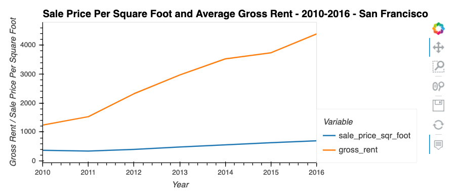

# HousingRentPricesAnalysis

    This repo is an analysis based on San Francisco housing data. It creates aggregations by years and nieghborhoods, visualizes
    it on interactive charts and suggests geospatial analysis, to find properties in the San Francisco market that are viable 
    investment opportunities.
    
    The repo consists of following parts:
    
    * Calculates and plots the housing units per year.
    
    
    * Calculates and plots the average prices per square foot.
    

    * Compares the average prices by neighborhood.
    

    * Builds an interactive neighborhood map.
    
    ## Technologies

---

## Technologies

JupyterLab web application

This project leverages python 3.7 with the following packages:

    * [pandas](https://github.com/pandas-dev) 
    * [PyViz] by using the comand line (conda install -c pyviz hvplot geoviews) 
    

---

## Usage

To use the Housing/Rent Prices Analysis clone the repository, open it with Jupyterlab and run the 

    * san_francisco_housing.ipynb

## Contributors

        UC Berkley
---
## License

    

